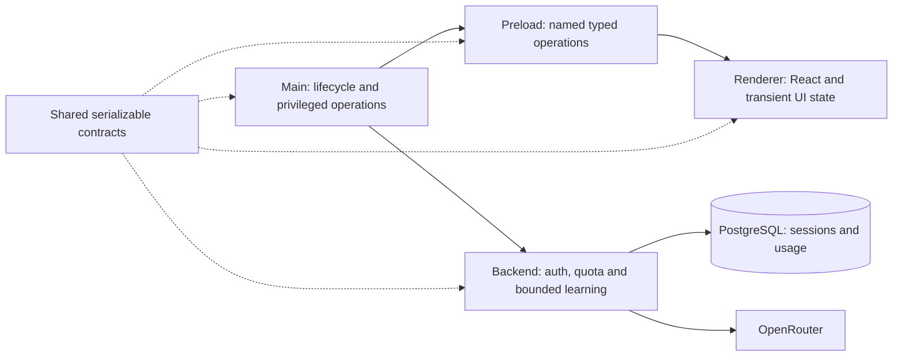

# Application architecture

September 8 build decisions: stable Drizzle with better-sqlite3 is selected and integrated for local project/entry records; meaningful immutable content revision history replaces the historical universal event-log/JSONL foundation. The reviewed storage candidate preserves legacy data through verified backups and transactional migration; combined desktop verification is tracked in AR-26. Source/path records and their UI operations remain pending. PostgreSQL with Drizzle serves backend account/session/usage responsibilities in a separate candidate under review. The [workbench contract](workbench-contract.md) defines the migration and shared record boundaries. These selections are recorded in AR-28.

See the [decision audit](decision-audit.md) before interpreting open/unimplemented items below: several have prior recorded selections or later revisions that need reconciliation.

The [active presearch](presearch.md) now conditionally reaffirms Electron for a desktop first release, subject to compatibility, targeting, isolation and offline validation. The exact version, supported operating systems and detailed process design remain open. The founder has since authorized the [working MVP](mvp.md). Its implementation does not establish that every earlier product validation target has passed.

The implemented foundation is a single Electron application package with React, TypeScript, electron-vite, and handwritten CSS. Node 24 LTS runs development tools. Electron carries its own runtime; the lockfile pins the actual versions. Vite 7 is intentional because electron-vite 5 declares compatibility through Vite 7.

The current MVP adds a local workspace store, named validated commands, a bounded
development OpenRouter adapter and an isolated guest view. The AR-12 backend
foundation implements production credential ownership, authentication and monthly
usage accounting; the desktop account/session slice now connects to Better Auth
and the public account endpoint without yet adopting backend learning results.
`context/mvp.md` owns the precise desktop scope, configuration and deferred work.
No durable job engine, sync service or arbitrary-code runtime is implemented.

The [AR-33 corpus acquisition checkpoint](corpus-acquisition.md) provides
guarded HTTPS acquisition, canonical text and exact passages behind the reviewed
sourcing contracts. It uses the backend's Node runtime and pinned parse5 parser;
its immutable corpus snapshots do not add persistence, a job engine or a
desktop adoption route. Corpus persistence and producer integration remain
separate acceptance work.

## Accepted authority model

The founder subsequently selected [app-managed AI credentials](credentials.md) in
AR-12: the company OpenRouter key stays on an authenticated backend, and end users
sign in to Applied Research. This supersedes direct user-key import as the
production flow. The desktop account/session boundary uses Railway and Better Auth
with GitHub sign-in; live deployed authentication remains unverified. Seven-day
rolling sessions renewed after one day and US$20 per user per UTC calendar month
with no daily limit remain backend policy. The concrete supported Electron flow
and remaining external credential setup are tracked in
[credentials](credentials.md).

The founder explicitly accepts local control over saved learning work, observation scope and desktop actions, with bounded remote services for AI and compute. The desktop checks returned results before applying them. This is a selected design responsibility, not implemented behavior or permission for unrestricted automation.

The logical responsibilities are presentation, local coordination, local learning storage, embedded-tool control and bounded remote work. The embedded tool is untrusted content even inside the application window. Exact process placement and message schemas remain open; local authority does not require every operation to run in Electron's main process.

See the [accepted authority diagram](diagrams/local-authority.html) and [scope and validation receipt](diagrams/local-authority.md). The [active presearch](presearch.md) records Answer 21 and its limits. Backend provider/credential ownership is now selected and its server foundation is implemented; data retention, backup/sync, deferred task recovery and broader action permissions still need decisions. No application validation or implementation is implied by diagram checks.

## Implemented process responsibilities

- **Main** owns window/guest lifecycle, permission and navigation policy,
  validated IPC dispatch, the local SQLite workspace store, and Better Auth's
  Electron client/session transport. The provider key-file importer is retired;
  direct tutoring is disabled in packaged behavior and requires explicit
  non-packaged development opt-in. Better Auth receives `getWindow: () => null`,
  so its successful-authentication user payload is not sent on the SDK's raw
  `better-auth:authenticated` channel. Version 1.7.3 can still send an SDK-owned
  `better-auth:error` event to Electron's focused window after an internal fetch
  error; preload exposes no listener for that channel, and sandboxing/context
  isolation keep it outside the public bridge. Recheck and remove that coupling
  when upgrading the SDK.
- **Preload** exposes named workspace, public account/session, tutor and tool-view
  operations plus typed state subscriptions. It bundles to CommonJS for
  Electron's sandbox. No raw IPC, cookies/tokens, provider credentials, SQL or
  Node primitives cross this seam.
- **Renderer** owns presentation. ESLint rejects imports from Electron, Node, main, and preload. Transient selection/focus/viewport state belongs here; durable drafts will need validated operations into trusted local storage.
- **Contracts** contains types that cross the process seam. Add runtime validation when external inputs or commands are introduced; TypeScript alone does not validate messages.
- **Backend** owns Better Auth GitHub/Electron server routes, authoritative PostgreSQL sessions, account-scoped UTC-month usage and the validated OpenRouter adapter. `src/contracts/learning-api.ts` is its exact serializable public learning contract. Effect owns composition, reservation/settlement interruption boundaries and scoped pool finalization; PostgreSQL work has finite server/client timeouts, and the backend never receives a body-supplied account id. Per-account admission permits at most two active provider requests while terminal uncertainty continues to count against money, not the active slot.
  The fixed same-origin `/auth/electron/callback` page loads a self-hosted bundle
  of Better Auth's Electron proxy client under a restrictive CSP and calls
  `ensureElectronRedirect()`. The backend pins Electron social sign-in to that
  page; it never trusts a caller-selected callback destination. The page reads
  only the short-lived SDK redirect cookie and neither displays nor stores its
  value.

Context isolation, renderer sandboxing, disabled Node integration, denied new
windows, restricted document navigation, and denied permissions are explicit
defaults. Production CSP disallows renderer networking and inline scripts.
Development permits Vite refresh and its localhost WebSocket. Account/session
traffic runs in main against the fixed backend origin. Production learning calls
move to the implemented backend in the next adoption slice; the old direct path
cannot run in a packaged build. The renderer keeps its networking restriction.
The guest has a separate persistent session, denied permissions/popups/downloads,
no preload and no Node integration. Main reads bounded page text only for a
requested question or navigation cue during an explicitly started guided
activity.

## Extending the MVP

The [AR-19 Practical producer checkpoint](practical-work.md) now implements transaction-scoped attempt revisions and selected-file retention using the existing store-owned Drizzle connection. Its additive SQL migration, named IPC operations and Shell/companion integration remain with AR-37/25; the separate service tests are not evidence that the shipped desktop already persists Practical work. No second connection owner, observation runtime or direct provider path is added.

Create modules when their behavior is implemented. Future responsibilities include structured Learning Paths, ingestion and Playbook export. Do not create speculative modules for these before implementing their behavior.

Use source-format and model-provider adapters when actual implementations vary. Keep one concrete persistence implementation until another is needed. Avoid per-table generic repositories, global event buses, and dependency injection containers without a demonstrated need. Plain modules and functions are sufficient for the current scaffold.

Before domain implementation, design stable source/artifact identities, human-author constraints, path revisions, crash recovery, and the activity → result → reflection loop. Keep source sentence references distinct from evidence imported from experiments. See [current product direction](product.md).

## Verification surfaces

- Unit tests cover command validation, real SQLite persistence/reopen, provider response parsing and failures, mathematical relationships and user interactions.
- Backend unit/HTTP tests cover strict request/provider decoding, well-formed Unicode and scalar-aligned citations, slow-auth disconnects, idempotency outcomes, quota accounting, concurrency/backpressure, upstream response cancellation and scoped shutdown using synthetic provider and database responses.
- `npm run test:backend:postgres` is the separate destructive-on-purpose disposable-database verification for the real Drizzle/PostgreSQL schema, Better Auth session adapter and concurrent ledger transactions. It refuses a URL whose database name does not contain `test`, `ar12` or `disposable`; it must not be represented as passed by unit doubles.
- Coverage applies to testable implementation; lifecycle/entry wiring is explicitly excluded and exercised through real Electron smoke tests instead.
- Electron tests verify local work across restart, the loaded bridge, renderer
  isolation, popup denial, an isolated embedded guest, a recorded development-only
  OpenRouter flow, and synthetic Better Auth cancellation/encrypted
  persistence/restart/sign-out behavior. Synthetic backend responses are not live
  GitHub or Railway evidence.
- The same smoke test runs against the unpacked application, catching missing preload/renderer files and packaging mistakes.
- CI runs on Linux, Windows, and macOS. This is a scaffold verification floor; live provider/learning-quality evaluations and production capacity checks remain outstanding.

## Source indexing checkpoint

AR-34 adds a backend-only [versioned passage-index adapter](source-index.md), using AR-30's source/evidence contracts and an injected canonical acquisition/access authority. Synthetic HTTP transport exercises the official turbopuffer REST request shapes, external-vector generation matching, scoped ANN/BM25 retrieval, rank fusion and bounded indexing/deletion. AR-48 optionally composes a live Oregon transport behind `SOURCE_INDEX_LIVE` with backend-only credentials, Qwen 8B/1024 embeddings and a shared $0.25 evaluation ledger. Default configuration keeps live indexing off. Canonical sources and durable permission/tombstone state remain authoritative outside the index; an indexed chunk is not independently trusted evidence. See [sourced backend](sourced-backend.md).

## Sourced learning integration seam — AR-36 / AR-48

The additive [sourced learning backend](sourced-learning.md) retrieves and
validates immutable evidence before using the existing authenticated learning
service for path generation, lesson generation and separate semantic support
checks. AR-48 registers authenticated `POST /v1/sources/discover`,
`/v1/sources/acquire` and `/v1/learning/sourced` against the Better Auth session.
It returns supported work with explicit coverage gaps, exact source origins,
generated lesson identity and backend phase timings. It does not save local
records or generate an entire course. Main-owned explicit acceptance remains
required. Details live in [sourced backend](sourced-backend.md).

## Trusted source adoption checkpoint

[AR-37 source adoption](source-adoption.md) adds main-only acquisition/generation
acceptance to the local store. Validated remote editions map to per-project local
UUIDs; source content, provenance and Canvas placements commit atomically. Generated
teaching text remains AI-authored and separately references immutable originals.
Project/request-scoped commit capabilities reject cancellation and stale results.
No trusted-content write is exposed through preload; actual authenticated producer,
selection and shell wiring remain dependent integration work.

The [AR-37 production integration repair](source-adoption-integration.md) installs the named main/preload operations and Shell consumers. `SourceDesktopOperations` owns selected project/request lifetimes; renderer payloads contain bounded requests and identities, never trusted canonical content. Its authenticated HTTP adapter is a required outside-lane composition dependency and is explicitly unavailable until supplied. Practical records use the same SQLite connection and registered additive migration. AR-36 source/teaching/path bundles commit in one outer transaction. Portable source validators take host-supplied hashing; main no longer imports backend services or Effect. Archived editions are decoded separately from current transport admission, and corrupt provenance is isolated to its owning project.
