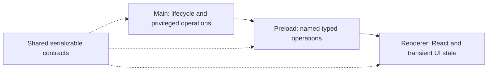

# Application architecture

September 8 build decisions: stable Drizzle with better-sqlite3 is selected and integrated for local project/entry records; meaningful immutable content revision history replaces the historical universal event-log/JSONL foundation. The reviewed storage candidate preserves legacy data through verified backups and transactional migration; combined desktop verification is tracked in AR-26. Source/path records and their UI operations remain pending. PostgreSQL with Drizzle serves backend account/session/usage responsibilities in a separate candidate under review. The [workbench contract](workbench-contract.md) defines the migration and shared record boundaries. These selections are recorded in AR-28.

See the [decision audit](decision-audit.md) before interpreting open/unimplemented items below: several have prior recorded selections or later revisions that need reconciliation.

The [active presearch](presearch.md) now conditionally reaffirms Electron for a desktop first release, subject to compatibility, targeting, isolation and offline validation. The exact version, supported operating systems and detailed process design remain open. The founder has since authorized the [working MVP](mvp.md). Its implementation does not establish that every earlier product validation target has passed.

The implemented foundation is a single Electron application package with React, TypeScript, electron-vite, and handwritten CSS. Node 24 LTS runs development tools. Electron carries its own runtime; the lockfile pins the actual versions. Vite 7 is intentional because electron-vite 5 declares compatibility through Vite 7.

The current MVP adds a local workspace store, named validated commands, a bounded OpenRouter adapter and an isolated guest view. `context/mvp.md` owns the precise scope, configuration and deferred work. No durable job engine, sync service or arbitrary-code runtime is implemented.

## Accepted authority model

The founder subsequently selected [app-managed AI credentials](credentials.md) in AR-12: the company OpenRouter key stays on an authenticated backend, and end users sign in to Applied Research. This supersedes direct user-key import as the production flow. The current desktop implementation below has not yet been migrated; the founder selected Railway and Better Auth with GitHub sign-in on 2026-09-08 UTC. The founder subsequently approved seven-day rolling sessions renewed after one day and US$20 per user per UTC calendar month with no daily limit. Railway provisioning is authorized; actual deployed authentication remains unverified. The concrete supported Electron flow and remaining external credential setup are tracked in [credentials](credentials.md).

The founder explicitly accepts local control over saved learning work, observation scope and desktop actions, with bounded remote services for AI and compute. The desktop checks returned results before applying them. This is a selected design responsibility, not implemented behavior or permission for unrestricted automation.

The logical responsibilities are presentation, local coordination, local learning storage, embedded-tool control and bounded remote work. The embedded tool is untrusted content even inside the application window. Exact process placement and message schemas remain open; local authority does not require every operation to run in Electron's main process.

See the [accepted authority diagram](diagrams/local-authority.html) and [scope and validation receipt](diagrams/local-authority.md). The [active presearch](presearch.md) records Answer 21 and its limits. Providers, direct access versus an application backend, credentials, data retention, backup/sync, task recovery and action permissions still need decisions. No application validation or implementation is implied by diagram checks.

## Implemented process responsibilities

- **Main** owns window/guest lifecycle, permission and navigation policy, validated IPC dispatch, the local SQLite workspace store, OpenRouter requests and credential access. Operations live behind focused modules; no worker or distributed runtime is installed.
- **Preload** exposes named workspace, tutor, provider-status and tool-view operations, plus typed tool-state subscriptions. It bundles to CommonJS for Electron's sandbox. No raw IPC, credentials, SQL or Node primitives cross this seam.
- **Renderer** owns presentation. ESLint rejects imports from Electron, Node, main, and preload. Transient selection/focus/viewport state belongs here; durable drafts will need validated operations into trusted local storage.
- **Contracts** contains types that cross the process seam. Add runtime validation when external inputs or commands are introduced; TypeScript alone does not validate messages.

Context isolation, renderer sandboxing, disabled Node integration, denied new windows, restricted document navigation, and denied permissions are explicit defaults. Production CSP disallows renderer networking and inline scripts. Development permits Vite refresh and its localhost WebSocket. OpenRouter calls run in main. The renderer keeps its networking restriction. The guest has a separate persistent session, denied permissions/popups/downloads, no preload and no Node integration. Main reads bounded page text only for a requested question or navigation cue during an explicitly started guided activity.

## Extending the MVP

Create modules when their behavior is implemented. Future responsibilities include structured Learning Paths, ingestion and Playbook export. Do not create speculative modules for these before implementing their behavior.

Use source-format and model-provider adapters when actual implementations vary. Keep one concrete persistence implementation until another is needed. Avoid per-table generic repositories, global event buses, and dependency injection containers without a demonstrated need. Plain modules and functions are sufficient for the current scaffold.

Before domain implementation, design stable source/artifact identities, human-author constraints, path revisions, crash recovery, and the activity → result → reflection loop. Keep source sentence references distinct from evidence imported from experiments. See [current product direction](product.md).

## Verification surfaces

- Unit tests cover command validation, real SQLite persistence/reopen, provider response parsing and failures, mathematical relationships and user interactions.
- Coverage applies to testable implementation; lifecycle/entry wiring is explicitly excluded and exercised through real Electron smoke tests instead.
- Electron tests verify local work across restart, the loaded bridge, renderer isolation, popup denial, an isolated embedded guest and a recorded OpenRouter flow.
- The same smoke test runs against the unpacked application, catching missing preload/renderer files and packaging mistakes.
- CI runs on Linux, Windows, and macOS. This is a scaffold verification floor; live provider/learning-quality evaluations and production capacity checks remain outstanding.
