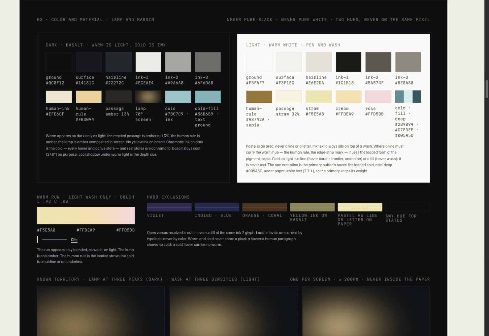
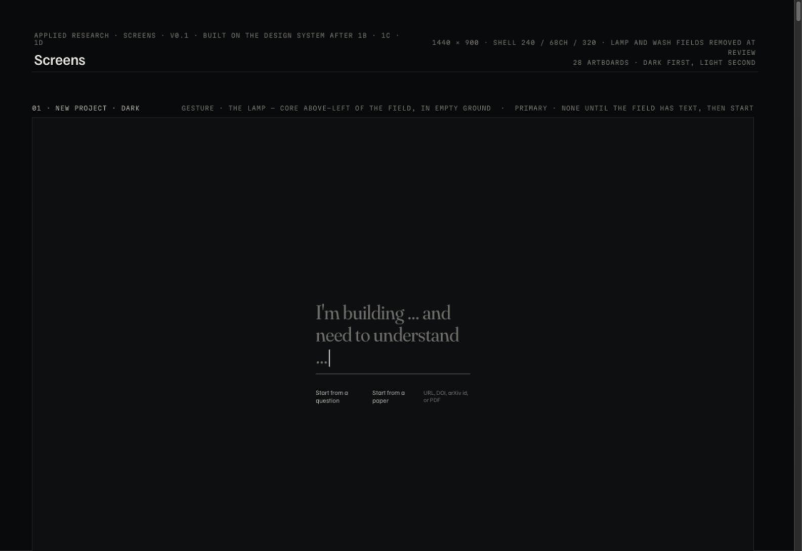
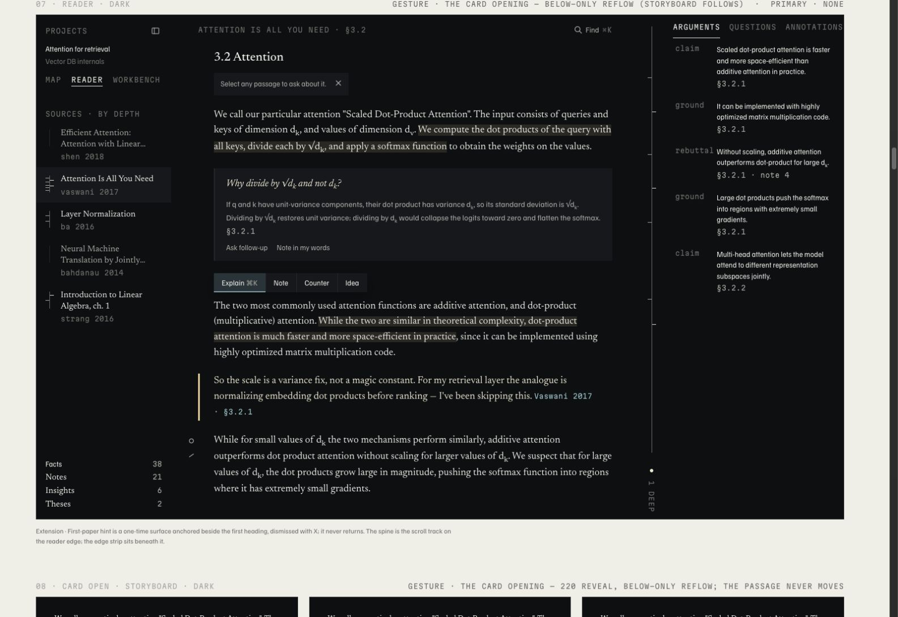
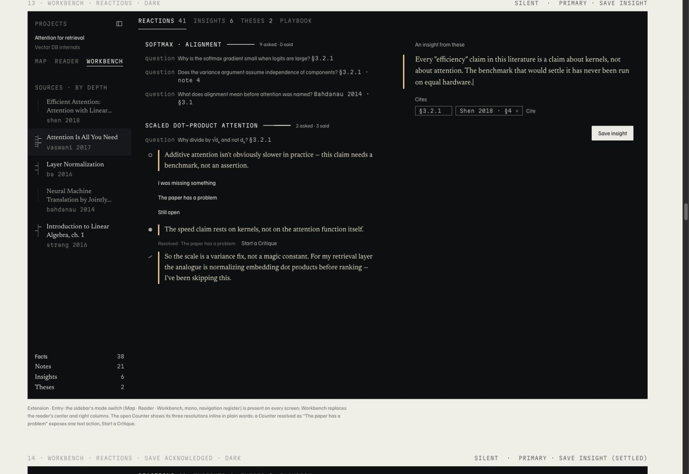
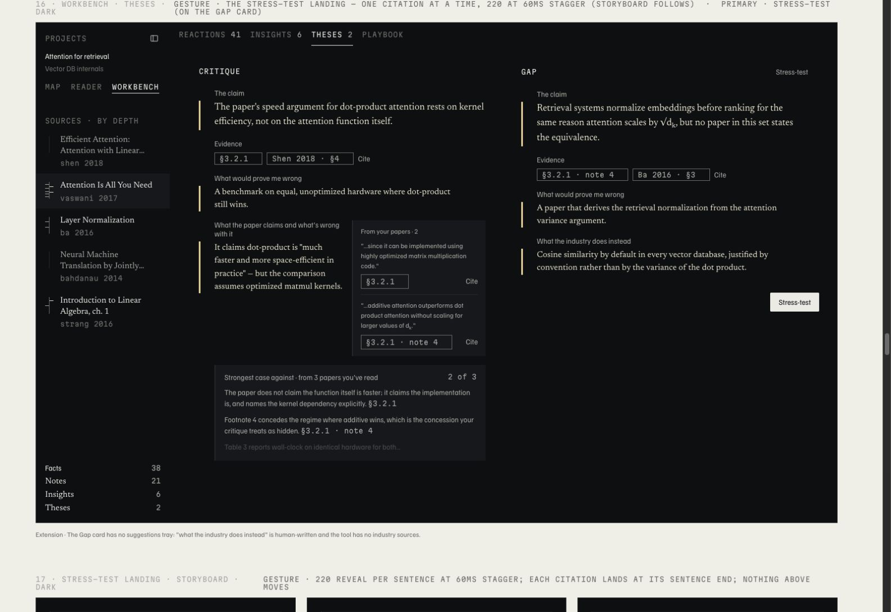
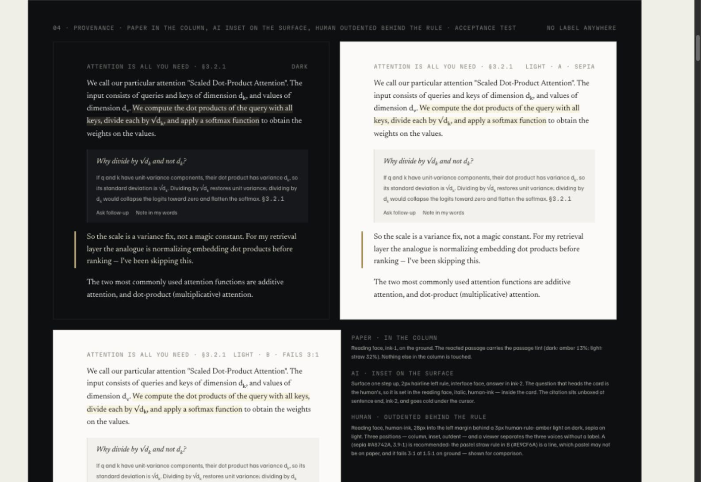
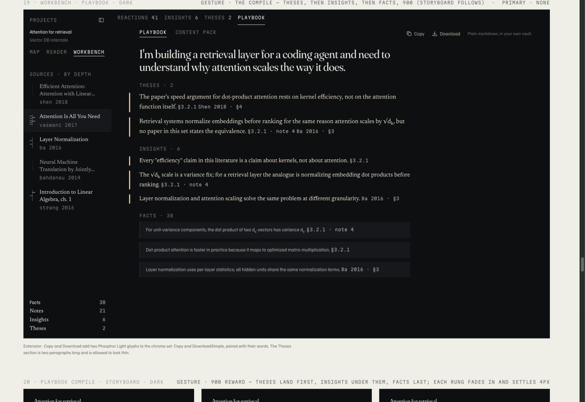
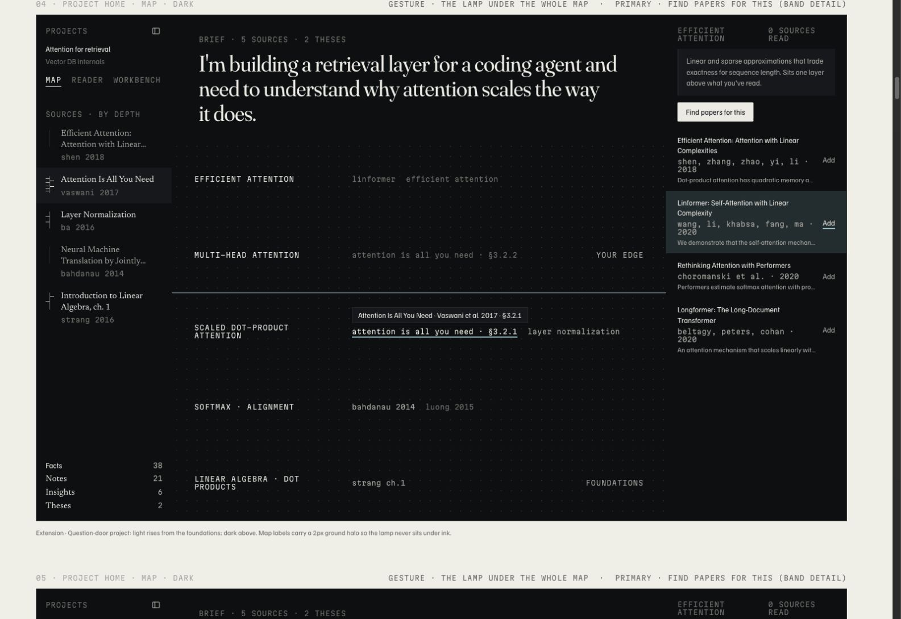

# Applied Research: the reading room and the work of thinking

A studio teardown and design case study · 2026-09-05

**Method:** two independent assessments, A `/root/design_review` and B `/root/technical_evidence`, followed by a source-led studio synthesis. Assessment A was kept separate from detector findings. This review evaluates the supplied design artifacts and the product they propose; it does not claim a production application or completed user study exists.

## The studio verdict

Applied Research has a strong, product-specific idea: make the difference between reading, receiving an explanation, and forming a thought visible in the fabric of the interface. The serif reading voice, inset AI surface, outdented human paragraph, and reaction spine express that idea more convincingly than another chat panel or collection of colored badges would.

The design is most successful at the scale of **one passage, one question, one human response**. At that scale, it has authorship, restraint, and a recognizable relationship to the work. At the scale of a project, a week of research, or a finished thesis, the system becomes less resolved. It replaces some useful explanations with subtle symbols, repeats navigation and counts, and sometimes presents activity as if it were knowledge. Its rules are more complete than its decision-making flows.

The next studio move should be to make the existing identity more reliable and expressive through use: knowing what a citation supports, recovering the exact reading position, finding the reaction that matters, revising a claim, and exporting a document whose provenance survives outside the app. A new decorative direction would leave those questions unanswered.

**Retain:** the editorial typography, spatial authorship, restrained palette, passage-level interactions, evidence beside human writing, and a quiet acknowledgement of saved work.

**Rework:** source authority, low-contrast metadata, the knowledge metaphor, the relationship between reading and synthesis, the lifecycle of a thesis, and the unproven promises about motion and recovery.

### Design health: 23/40

This is a heuristic score for the proposed working interface and represented states. It is a design judgment, not an accessibility certification or a measured user-satisfaction score. All ten heuristics apply. The independent design review supplied the scoring; the technical review corroborated several underlying findings without seeing those scores.

| Heuristic | Score / 4 | Principal reason |
|---|---:|---|
| Visibility of system status | 2 | Useful spines and acknowledgement; contradictory counts and missing trust states. |
| Match with the real world | 3 | Paper/margin/evidence metaphor fits; “known” overstates what activity proves. |
| User control and freedom | 2 | Return and Undo specified; durable draft/revision recovery unproven. |
| Consistency and standards | 2 | Coherent materials; conflicting component, screen, and PRD contracts. |
| Error prevention | 2 | Required evidence and falsification; core entry/verification states incomplete. |
| Recognition rather than recall | 3 | Labeled verbs and adjacent evidence; ambiguous mixed-paper citations and pen codes. |
| Flexibility and efficiency | 2 | Useful shortcuts; core filters, dense data, and keyboard behavior incomplete. |
| Aesthetic and minimalist design | 3 | Strong reader; crowded thesis composition and over-muted metadata. |
| Error recognition and recovery | 2 | Parse escape and missing-field copy; answer/export/verification failures undesigned. |
| Help and documentation | 2 | Contextual first-paper hint; empty ending and pack usage lack orientation. |
| **Total** | **23/40** | **Acceptable foundation; substantial work before a dependable release.** |

### Five priorities, in order

| Priority | Problem and consequence | Concrete next move |
|---|---|---|
| **P1 · Trust and status** | Quiet presentation masks missing verification/failure states; contradictory counts weaken confidence in the instrument. | Design the complete paper-first status set, correct the unsupported example assertions, and derive each artboard's counts from one fixture. |
| **P1 · Provenance through synthesis/export** | Human insights are flattened into their source citations; mixed-paper locators are ambiguous; Notes and thesis caveats are not clearly retained. | Preserve event-to-event references, qualify citations outside the reader, show the actual pack, and resolve the output contract. |
| **P1 · Readability and first-entry layout** | Important 12–13px text fails normal-text contrast; the Brief's measure inherits the wrong font context. | Add a readable metadata token and apply the Brief measure at its actual display typography. |
| **P2 · One active thinking task** | Competing theses and nested evidence compress the human field; source context is wrong in layer specimens. | Focus one thesis, expose relevant material, add current-core filters, and make the context panel follow the active source. |
| **P2 · Coherent handoff** | Removed lamp semantics, stale captions, and PRD/export conflicts leave implementers guessing. | Publish one versioned current specification with explicit decisions and core/stretch coverage. |

P1 means address before release; P2 means a significant next design pass. No P0 production blocker is asserted from static reference artwork.

## 1. What was reviewed

The [imported system](<Design System Canvas Setup/Applied Research - Design System.dc.html>) contains eight artboards: posture, provenance, type, color/material, 19 numbered components, primitives, motion, and glossary. The [screen export](<Design System Canvas Setup/Applied Research - Screens.dc.html>) contains 28 artboards, including dark/light variants and storyboards. They are accompanied by the original runtime, one uploaded image, and export metadata.

The evidence set also includes the original system brief, revisions 1b–1d, the screen brief, and the September 4 MVP PRD. The [manifest](review-evidence/import-manifest.json) records file hashes and every artboard's ID and source line. **DS** below means the design-system HTML; **SC** means the screen HTML. For example, `SC s7, line 251` identifies the dark reader. Line numbers refer to the unchanged imports.

The review combines source inspection, rendered browser inspection, a deterministic scan, color calculations, independent design judgment, and a targeted check against the paper used in the examples. Findings are separated into:

- **Observed:** present in the exported source or rendered artifact.
- **Specified:** described by a brief or caption, without proven working behavior.
- **Inferred:** a likely usability or emotional consequence that needs observation with users.
- **Proposed:** a recommendation from this review, not an approved product change.

The 1440 × 900 screen rectangles are reference artwork. Canvas overflow at smaller browser widths is not evidence of a broken responsive product. Desktop is the intended product scope; mobile app design is not a missing deliverable. Desktop window resizing, zoom, keyboard access, and long-document behavior still need contracts.

## 2. The brief: where the design gets its character

The intended user is a builder learning an unfamiliar research domain in order to make something. The product's output is a Playbook and an agent Context pack, assembled from research and the builder's own thinking. AI can provide facts and explanations; the higher-level insights and theses belong to the human.

That gives the visual system a useful task: distinguish **source**, **assistance**, and **authorship** without making the reader continually classify content. The most authored part of the design is this distinction. Dark backgrounds, serif headlines, small monospaced labels, and hairlines could be reused by many contemporary software products. The margin grammar is harder to transplant because it encodes the product's central argument.

A forward-looking studio should judge this project on the quality of its authorship and evidence model, not on whether it includes the current fashionable gradient, oversized type treatment, or animated cursor. Its strongest possible expression is a working research instrument that remains composed under uncertainty.

### The revision history is itself a case study

| Stage | Decision | What improved | What remains unresolved |
|---|---|---|---|
| Original brief | Basalt, warm paper, straw/cream/rose; color marks human presence; surface versus ground distinguishes authorship. | A coherent conceptual starting point. | Washes alone were doing too much semantic work. |
| Revision 1b | Separate dark illumination from light pigment; simplify citations; split misleading depth/density components; define primitives. | The system starts distinguishing visual metaphor from functional geometry. | Some distinctions remain understandable only after reading the design explanation. |
| Revision 1c | Warm authorship, cold interaction; outdented human rule; asked/said spine; Workbench rungs; accessibility improvements; five motion signatures. | Stronger hierarchy and a more ownable visual grammar. | Questions inside AI cards, AI-generated explainers, and font-only ladder provenance complicate the simple material rule. |
| Revision 1d | One lamp under the map; loaded cold primary hover in light mode; revised path truncation; segmented thesis kind; Phosphor chrome. | Fewer arbitrary exceptions and better control-state contrast. | Long-content, dense-data, and keyboard behavior remain largely described. |
| Exported screens | Header records removal of lamp and wash fields. | A quieter, more severe presentation. | Captions and some copy still rely on the removed illumination to explain knowledge and navigation. |
| September 4 MVP PRD | Electron; paper-first core; Map/calibration/stretch; Settings and real export requirements. | A more concrete buildable product path. | The visual handoff still emphasizes the earlier map-first concept and omits important new core surfaces. |

This is a sequence of meaningful design decisions, not a reason to restore the oldest brief. The removed lamps may represent the right simplification. What is missing is an explicit replacement for the information they once carried.

## 3. Color and material: distinctive roles, fragile edges

The cool ground `#0C0F12` and warm reading ink `#ECEAE4` create a disciplined dark environment. The light ground `#FBFAF7` is warm without turning the whole interface into parchment. Neither needs a more saturated brand palette. The important issue is assignment: when does a color carry information, when does it describe an action, and when does it simply set atmosphere?

The warm/cold distinction is useful because it gives interaction an independent channel. A cold hovered citation can say “this is available” while the warm margin rule says “you wrote here.” The light-mode separation between `#2B9094` for lines, `#C7EDEE` for pale fills, and `#005A5D` for the primary hover is an unusually considered detail. It recognizes that an attractive accent is not automatically a readable text color.

The visual restraint becomes counterproductive where tertiary ink is used for meaningful reading. Navigation labels, locators, authors, dates, and source status are not atmosphere. Muting all of them makes the interface feel refined in a still image while slowing down the working reader. Use low contrast for decoration and genuinely inactive controls; give necessary metadata a readable text token.

The independent calculation gives the following actual token ratios. Full values and compositing inputs are in [contrast.json](review-evidence/contrast.json).

| Foreground / background | Dark | Light | Reading |
|---|---:|---:|---|
| Primary ink / ground | 15.975:1 | 16.500:1 | Strong body-text contrast. |
| Secondary ink / surface | 7.347:1 | 6.391:1 | Suitable for answer and citation text. |
| **Tertiary ink / ground** | **3.719:1** | **3.300:1** | **Fails the 4.5:1 normal-text threshold.** |
| Tertiary ink / surface | 3.452:1 | 3.051:1 | Also fails for normal text. |
| Human rule / ground | 13.317:1 | 3.872:1 | Exceeds 3:1 as a graphical cue. |
| Cold / ground | 9.934:1 | 3.645:1 | Light cold should remain a line/fill role, not small text. |
| Actual primary-hover text / fill | 8.042:1 | 7.678:1 | Both pass; light uses cold-deep. |
| Hairline / ground | 1.276:1 | 1.238:1 | Decorative use only if no other sufficient cue exists. |

WCAG AA requires 4.5:1 for normal text, with a 3:1 threshold for qualifying large text and exceptions such as genuinely inactive controls. An inactive tab remains available navigation; it is not a disabled control. Pass/fail uses unrounded values. These token checks do not establish conformance across every composited background. [W3C contrast guidance](https://www.w3.org/WAI/WCAG22/Understanding/contrast-minimum.html).

The hairline is also not a universal border. The contrast between surface and ground is intentionally slight. That is appropriate for an AI inset whose text and position supply additional cues. It is insufficient when a thin line alone must identify an editable field, a selected region, or an actionable boundary. The system's own later revisions recognize this; implementation needs to keep the distinction explicit.

The lamp and watercolor are the largest unresolved material decision. In the system, a luminous territory is a map of what the user knows. In the screens, those fields have been removed, but the edge line and captions remain. The map becomes a series of labels on a dot grid, with limited visible evidence for why one region is “known.” Restore a meaningful state representation before deciding whether to restore the material. A quieter alternative could use labeled reading/reaction states and a visible reason for a frontier position.

**Studio recommendation:** preserve both theme palettes and the two semantic hue families. Replace a universal `ink-3` text role with separate decorative, disabled, and readable metadata roles. Treat illumination as optional expression over an independently understandable state model. Recheck text on actual composited washes; testing an isolated hex pair does not certify a gradient.

## 4. Typography: the strongest system, with an overworked sorting voice

The four faces have intelligible jobs: Newsreader for the paper and human writing, Familjen Grotesk for interface and AI assistance, Martian Mono for coordinates, Fraunces for the Brief. Four families is a substantial typographic budget, but here it has a rationale. The goal should be to make each family earn its place rather than reduce the count by convention.

Newsreader at 18px/1.55 is a plausible sustained-reading starting point. Its presence in human notes makes a note feel like writing rather than a form submission. The inset sans-serif answer creates a change of register before the reader has parsed a label. Fraunces introduces a personal opening sentence without requiring a logo to dominate the product.

Martian Mono is the weak point when it becomes the default language of everything secondary. Tracked capitals require horizontal space. At 12px, long navigation labels and paper titles become a texture of coordinates. On the map, monospaced paper names sit beside monospaced concept names; casing has to do too much work to separate content from structure. In the narrow arguments rail, long role labels consume room that should belong to the claim.

A reading interface should distinguish metadata from prose without making metadata difficult to read. Retain mono for locators, compact counts, and stable identifiers. Use the UI face for long navigation names and paper discovery results. Make capitalization a semantic choice rather than a general signifier of sophistication.

The source rows illustrate a further inconsistency: the screen artwork uses serif titles, while earlier component guidance calls for UI-face titles. The serif rows are pleasant, but they weaken the statement that the reading face identifies paper prose and human authorship. Choose deliberately whether a source title is an editorial object or navigation, then document that exception.

The Brief is successful when it establishes intent. Repeating a large, multi-line Brief above the daily map can become a tax on the working viewport. Preserve the expressive opening, then allow a compact, expandable project intent in repeat use. This is a proposal to test, not a reason to strip character from the initial encounter.

There is also a concrete initial-layout defect: in `SC s1, lines 30–32`, the `width:34ch` container inherits the smaller UI typography while the child uses 40px Fraunces. Assessment A observed a roughly 310px-wide Brief field. The nominal “34 characters” therefore does not describe 34 display-size characters. Put the measure on the display text's own font context; preserve breathing room without leaving the central input unnecessarily narrow.

The font contracts should include loaded and fallback states, optical sizing, math compatibility, weight/line-height pairs, and text resizing. Merely listing Newsreader in CSS does not demonstrate that the font loaded or that a formula and its neighboring prose share a good baseline.

## 5. Composition: the passage works; the shell competes

The reader's central composition is the most convincing artifact. The eye can follow paper text, enter the answer surface, and return to the outdented human paragraph. The rule does real work. It gives human writing an address in the document without enclosing every thought in a card.

The “paper is the screen” principle is less convincing at shell scale. A 240px source rail and 320px context rail reserve 560px before gutters and reader controls. At a 1280px window that leaves 720px for the center before its own padding; at 1440px it leaves 880px. **68ch must therefore be a maximum, not a width the system promises simultaneously with two fixed rails at every supported size.** The exact fit depends on the font metrics and cannot be inferred from the nominal character count alone.

The left rail contains projects, Map/Reader/Workbench navigation, sources, spines, metadata, and the ladder readout. The right rail contains three navigation tabs and an argument list. The center contains its own locator, finder, first-paper hint, toolbar, note markers, spine, and depth indication. Each item has a reason; collectively they dilute the claimed quietness.

Keep reading dominant through a clear panel policy. On narrower desktop windows or with enlarged text, collapse secondary context into a drawer that preserves its selected tab and target. Do not shrink the paper or all text to keep the screenshot composition intact. Test whether experienced readers prefer the arguments panel initially open; showing an AI interpretation continuously can direct the reader's thought before they form their own response.

The Workbench improves on a generic dashboard by placing material on the left and a writing area on the right. Its large areas of empty space are not inherently wasted: they can make thinking feel unhurried. The missing piece is a clear indication of which left-side material belongs to the active right-side draft. Without selection state and visible source relationships, the user must maintain that connection mentally.

In the Theses view, two thesis columns plus a nested suggestions tray create a composition inside a composition. The human claim becomes narrow next to the AI material. A focused thesis with its evidence rail would better preserve the stated human-first hierarchy. Keep comparison as a deliberate view when comparing theses is the actual task.

## 6. Authorship: a promising visual grammar needs a trustworthy semantic grammar

The system's three positions are persuasive: paper in the column, AI inset, human outdented. They distinguish authorship through geometry as well as color. That is a better foundation than relying on warm versus cold alone.

But the metaphor has exceptions. A human question sits inside the AI answer surface. A collapsed card displays only that human question, losing the surrounding context that made the exception understandable. Some ladder rows rely on typeface alone. A concept explainer may use full reading typography, which risks looking like the source paper. The product must account for these states instead of repeating “no labels” as if it solved them.

Use the no-badge rule to control visual noise, not to prohibit accessible names, contextual explanations, export attribution, or an optional authorship key. A screen reader must hear distinctions that a sighted reader gets from indentation. Plain Markdown will not preserve the warm rule or the inset surface. Authorship must survive copying, exporting, monochrome display, and changing theme.

More fundamentally, **authorship, evidence, and correctness are different properties**. An AI surface identifies who supplied text; it does not make the text true. A human rule marks ownership; it does not indicate whether the claim has been tested. A citation can resolve to a real sentence while failing to support the claim beside it.

The chain also weakens during synthesis. `SC s15, line 495` says “Cite into thesis” lands an insight's **citations** in Evidence. That does not visibly retain the human insight that connected the paper to the thesis, although the PRD supports event-to-event references. Preserve both the insight and its underlying sources. In a multi-paper Playbook, a bare `§3.2.1` needs a paper identity independent of whichever sidebar row happens to be active. The final document should also preserve or link to the falsifier and countercase, not only the polished claim.

The specimen makes this concrete. Its stress-test text attributes a performance concession to footnote 4 and begins a claim about Table 3 reporting equal-hardware timing. The paper's PDF uses footnote 4 for the variance argument; Table 3 concerns Transformer architecture variants and translation metrics, not that timing comparison. See the [targeted content check](review-evidence/source-fact-check.md) and the [primary paper](https://arxiv.org/pdf/1706.03762).

That is a design finding, not just an editorial typo. A calm, precise-looking evidence surface can give unsupported text more authority. The interface needs observable states for pending verification, unsupported claims, incomplete extraction, and changed evidence. These can be quiet and plainly worded. An absolute ban on status language would undermine the product's central promise.

## 7. The knowledge map: a memorable metaphor with an epistemic debt

The strata are a useful alternative to an unconstrained node canvas. They suggest prerequisite depth and let a reader identify a next area to investigate. Keeping the layout fixed avoids making users arrange the map before they can read.

The danger is turning a plausible organization into an apparent measurement. A paper's citation position is not a complete account of conceptual prerequisites. A user can react extensively to something they still misunderstand. Someone may read silently and understand it well. Asked/said composition records behavior; it does not measure understanding. A bright region labeled “known” makes a stronger claim than the events justify.

The system also combines two kinds of depth: location in a prerequisite hierarchy and distance from an originating reading passage. They are unrelated quantities. The path bar, edge dots, paper spine, and map bands need separate purposes and labels. A reader should not have to infer whether “2 deep” describes the document stack or conceptual difficulty.

There is a visual tension between a soft, irregular knowledge edge and a crisp horizontal frontier. Understanding can contain islands and holes. The paper-door concept acknowledges this with a lit slice, but the source and screen captions still lean toward a single boundary. If the Map ships later, show why a territory has its state and permit correction. A user-controlled seam or confidence note would be more honest than a visually authoritative boundary without explanation.

The retained dot grid deserves scrutiny after removing illumination. It implies a plotting space or manipulation surface, yet dragging is expressly excluded. It can remain as material if users do not try to interact with it; otherwise horizontal strata and source marks can provide sufficient orientation without the canvas metaphor.

## 8. Components: individual decisions and their consequences

This inventory covers the system's 19 numbered components, adjacent primitives, and extensions shown in the screen set. A pictured state is not proof of an implemented control.

| Element | What to keep | Critical issue / required next decision |
|---|---|---|
| 01 Selection toolbar | Four concrete verbs at the point of selection; no automatic AI response. | Define keyboard selection, multi-line anchoring, edge collision, Escape precedence, and stable shortcut hints. Hover-only disclosure excludes keyboard discovery. |
| 02 Inline card | Question and answer remain next to the motivating passage; sans/serif separates their voices. | The original “longer becomes a layer” rule conflicts with the newer PRD's internally scrolling card. Define overflow and preserve scroll/selection when content streams. |
| 03 Rabbit-hole layer | Pinned origin and exact return location turn exploration into a reversible action. | The pictured layer shows Layer Normalization while the right rail retains Attention claims. Update context or explicitly identify a pinned parent context. |
| 04 Path bar | First/last crumb preservation and a dedicated Escape slot. | Middle collapse needs an accessible reveal; lengthy first and last titles still need a truncation policy. Distinguish navigation history from topic hierarchy. |
| 05 Edge strip | A count without an invented maximum. | Dots at depth four need names and keyboard navigation; at depth twelve they need aggregation. They must not compete with the paper spine for the same gutter. |
| 06 Spine | Asked-left, said-right is compact and specific to this product. | At 22px high it communicates rough pattern, not reliable counts. Define overlapping hits, dense paragraphs, and a textual summary available on focus as well as hover. |
| 07 Map band | Stable strata and a context-specific discovery action. | Known/unread is underexplained after lamp removal. Long titles, uncertain prerequisites, and many papers per band have no convincing specimen. |
| 08 Source row | Active surface, title, metadata, and reaction trace. | Five sources are not forty. Provide a tested title/disambiguation strategy and a route to search/filter when the finder is unavailable as stretch. |
| 09 Type label | Plain names help recognition in lists. | Removing labels from human reactions shifts memory cost onto pen glyphs. Keep optional or contextual names without making every row a badge. |
| 10 Margin marker | Bespoke stroke/ring/star/hook makes reactions feel connected to writing. | The shapes must remain distinguishable at display scale and identifiable with assistive technology. Several 24px targets must not overlap. |
| 11 Citation | Unboxed at rest, sentence-adjacent, with a preview before leaving the passage. | Preview must work on focus, be dismissible and stable, and avoid layout shifts. Add source identity in mixed-paper lists. Resolve by canonical passage ID, not display text. |
| 12 Counter resolution | Three plain choices preserve the possibility that the reader was mistaken. | “The paper has a problem” should start a revisable draft, not certify the verdict. Show how a resolved counter can reopen or change its resolution. |
| 13 Thesis card | Claim, evidence, and falsifier form a substantive writing scaffold. | Disabled Save is unsuitable as the only persistence path for incomplete thinking. Keep drafts while distinguishing draft from complete thesis. Define kind-change behavior. |
| 14 Suggestions tray | Evidence is offered beside human text; nothing is inserted automatically. | Beside should not mean visually dominant. State which claim a passage supports or challenges. Cite should distinguish adding a source from endorsing the interpretation. |
| 15 Stress-test | Adversarial evidence is a useful human-first AI job. | “2 of 3” is ambiguous without a noun; partial text and unsupported statements need truthful states. Show the consequence of accepting a challenge: revise, qualify, or withdraw. |
| 16 Ladder readout | The progression is legible without exposing DOK jargon. | Counts recur in both rail and tabs, but Reactions and Notes/Facts are different categories. Explain the mapping and avoid treating counts as quality scores. |
| 17 Empty state | Honest counts and no forced illustration. | “Nothing to compile yet” gives no route forward. Link to an existing counter or paper with a neutral action; guidance is not a motivational nudge. |
| 18 Workbench | Co-locating source material and original writing is strategically right. | Identify active material and draft; support returning to source without losing either. Reconcile map grouping with the newer time-order/filter contract. |
| 19 Brief header | A personal, expressive sentence grounds the research. | An oversized repeat-use header consumes valuable space; define compact and expanded forms. New project needs a real paper-entry and project-name state under the current PRD. |
| Buttons | One clear primary, restrained 2px radius, distinct focus and hover. | Rest/hover/active/focus/disabled drawings need semantic buttons and real state ownership. A document view need not invent a primary action solely to satisfy a rule. |
| Human fields | Reading face and margin rule make writing feel native to the document. | Provide persistent labels, draft state, selection, validation, and recovery. Placeholder text and a line alone are not a complete input contract. |
| Segmented controls | Calibration and thesis kind share a coherent primitive. | Clarify single selection, arrow-key behavior, focus, and what changing a previous selection affects. |
| Sidebar tabs | A stable context panel is useful; locators connect arguments to the paper. | Three long tracked-uppercase labels are expensive in 320px. Shorten the layout cost, not the clarity; add selected state and keyboard semantics. |
| Finder | Local lookup is different from source discovery. | Modal focus/return and no-result states need proof. Scope the selection-sensitive shortcut so an old selection does not unexpectedly trigger Explain. Use platform-aware key labels. |
| Search result / Add | Compact abstract and explicit Add support contextual discovery. | Show adding/added/duplicate/failed states; retain the result and target layer on failure. |
| Icons | Restrained chrome and bespoke editorial markers belong to different visual roles. | The canvas says its SVGs approximate Phosphor geometry; production should use the chosen library. Every interactive icon still needs an accessible name, including X and Plus. |
| Ingest state | Progressive content is more useful than a blank waiting screen. | Show genuine pipeline status and what is readable now. Define failure, retry, cancellation, and incomplete-paper boundaries without pretending all waits are short. |
| Parse fallback / equations | Preserve the original document when extraction fails; math stays part of reading. | Provide source location, accessible equation text/MathML, zoom for crops, and return behavior. The latest PRD uses MathML, while the screen note mentions KaTeX. |
| Save acknowledgement / Undo | Local, quiet feedback respects attention. | Five seconds is a convenient shortcut, not an adequate full recovery model. Preserve drafts and an enduring route to revert or edit. |
| Playbook / Context pack | The user owns the final artifact; export is part of the product. | The pack needs a real view, destination, readiness state, and success/failure result. The compiled document must carry authorship and revisions after visual styling disappears. |
| Settings / desktop shell | Current PRD includes a concrete integration and storage model. | No complete exported artboard covers vault setup, keys, connection failures, MCP, or desktop window conventions. These are core onboarding and trust surfaces. |

## 9. Motion: good principles, insufficient evidence of feel

The prescribed 150ms touch, 220ms reveal, and 900ms reward vocabulary is coherent. The ease-out curve and absence of ambient movement fit sustained reading. Prohibiting bounce is reasonable for this particular visual world; bounce is not intrinsically bad design, but it would add a different personality here.

The best motion promise is that the paper does not move above the reader's eye. That promise is more valuable than the precise duration. It requires anchoring behavior across streaming, font changes, math layout, reopening answers, and returning from a layer. Storyboard frames cannot prove it. Nor can a caption prove that an animation is interruptible.

| Signature | Why it belongs | What a working prototype must establish |
|---|---|---|
| Card open · 220 | Makes room for assistance while maintaining source adjacency. | The selected passage remains fixed; content below moves; rapid open/close and streaming do not accumulate displacement. |
| Layer push · 220 | Makes departure and return spatially comprehensible. | Focus transfers to the active layer, background controls become inactive, Escape returns to the precise passage and selection. |
| Wash spread · 900 | Can make accumulated engagement perceptible. | Only run after a relevant action; tie the field to an honest state model; resolve whether this effect remains in the product after its visual removal. |
| Stress-test landing · 220, 60ms stagger | Could help the reader recognize the evidence arriving. | Claims and their verification state stay together. Do not create a period where uncited assertions look finished. Model latency must not be confused with animation timing. |
| Playbook compile · 900 | Marks a change from fragments to an owned document. | Real readiness controls the state. Reopening an existing Playbook should not force a ceremonial delay. Export remains available as soon as the document is ready. |

The system also retains a 280ms layer-frame caption despite the later 220ms rule. This is handoff drift, not an invitation to choose either value arbitrarily. Reconcile the storyboard with the current motion contract.

Reduced motion should go directly to the meaningful end state while keeping status and focus changes understandable. The design specifies this, but the export is not a demonstration of preference handling. WCAG's interaction-animation criterion is Level AAA; it should not be mislabeled as an AA requirement. This product can adopt it as its own quality bar. [W3C guidance](https://www.w3.org/WAI/WCAG22/Understanding/animation-from-interactions.html).

## 10. Utility, delight, and emotional tone

The intended emotional arc is good: “I am confused” → “I can ask here” → “I can say what I think” → “I can use what I learned.” The interface earns delight when it shortens the distance between those moments.

The cognitive burden is uneven. The reader does well at co-locating information and presenting four concrete selection actions. It does less well at making all secondary roles recognizable. The Workbench adds four rungs, two thesis kinds, three counter resolutions, source selection, citation insertion, and stress-testing. These are not all one simultaneous choice, so counting every visible label and declaring an overload would be misleading. The failure is more specific: several independent decision contexts are visible without a clear active one, and the relationship between source material and draft must sometimes be remembered. Progressive disclosure should reduce simultaneous tasks rather than arbitrarily cap every list at four items.

The strongest potential delight is exact restoration: return from a tangent and find the same line, the same selection, and the same draft. Another is seeing a sentence you wrote become part of the Playbook with its source relationship intact. Neither needs confetti or a new accent color.

There is also an emotional risk in the language of activity. “9 asked · 0 said” may be intended as neutral state, but it can sound like a judgment. Fourteen unresolved counters in an empty Workbench can make the user feel behind before the system helps them act. These are hypotheses to test with the actual cohort, not evidence that all metrics should disappear.

“Never speaks first” works as a ban on unsolicited coaching. It fails if interpreted as a ban on orientation, failure explanation, or a useful next step. “Open an unresolved counter” is a quiet navigational aid. It is not an exhortation. Preserve that distinction.

The strongest authored feeling comes from accumulating meaningful traces over time. Do not add more motion before testing whether those traces remain readable after ten papers and hundreds of reactions. A bespoke tool should become more useful as it acquires history, rather than only looking exceptional when pristine.

### Persona walkthroughs

**The first-time cohort researcher:** opens a paper, sees the one-time selection hint, asks a question, and then needs to turn that response into a note. The first passage interaction has a good route. The later “spine incomplete” wording and empty Workbench demand more prior knowledge. A recoverable contextual explanation and a direct route to existing counters would support this user without coaching them uninvited.

**The experienced builder:** has forty sources and wants the reaction behind a particular decision. Small source spines, abbreviated citations, and the absence of current-core filters increase search and recall. The finder is helpful in the design but is stretch in the current PRD. Core use cannot rely on its eventual availability.

**The keyboard or screen-reader user:** needs named citations, tabs, markers, fields, status, and layer boundaries. The export has no functional product controls and cannot demonstrate these flows. The future interface must express the same provenance nonvisually and return focus to the originating passage. This is a missing implementation contract, not a report of a failed screen-reader session.

## 11. Screen-by-screen coverage

| Artboards | Finding |
|---|---|
| s1–s2 · New project / drop | Strong sparse opening, but lamp captions describe removed content. Current core needs project name, editable paper identifier, filled/valid/loading/error states, and entry to Settings when setup is incomplete. |
| s3 · Calibration | Three choices per seam are understandable; the written explanation is a good bridge into human authorship. Avoid presenting self-report as verified mastery. Stretch scope should be explicit. |
| s4–s6 · Map variants | Visually disciplined but knowledge state is weakened after removal of fields. The paper-door variant needs a truthful explanation of gaps rather than one implied frontier. |
| s7, s9 · Reader dark/light | Strongest composition. Test contrast, panel widths, actual paper density, provenance exceptions, and keyboard-first use. |
| s8 · Card storyboard | Good below-only-reflow intention; no working scroll or streaming behavior proven. |
| s10–s11 · Layers | Contextual return is valuable; right panel still names the originating paper's claims. Distinguish parent context from active-source context. |
| s12 · Layer storyboard | Useful spatial spec, but focus, cancellation, and exact line restoration need execution. |
| s13–s14 · Reactions / Saved | Promising two-column synthesis; material-to-draft relationship remains implicit. Saved count updates locally while other counts remain visually unchanged. Define the event/count model before copying the specimen. |
| s15 · Insights | Requires a clearer draft-versus-complete distinction; an unfinished falsifier should not mean lost writing. |
| s16, s18 · Theses | Dense nested evidence beside two concurrent claims. The stress-test result needs a visible next action on the challenged thesis, not only another Stress-test button. |
| s17 · Stress-test storyboard | Timing and verification states are underspecified; specimen content includes unsupported source claims. |
| s19 · Playbook | Human-first order has editorial logic, but conflicts with current PRD order and omits the visible falsifier/countercase. Context pack is named without a full artifact preview. |
| s20 · Compile storyboard | Reward can communicate completion, but the document hierarchy must be settled before animating its assembly. |
| s21–s22 · Finder | Clear separation from external discovery. Need focus management, no result, result selection, and shortcut-precedence behavior; current scope is stretch. |
| s23 · Ingest | Shows progress inside the paper, but not the full lifecycle of an interrupted or failed operation. Distillation must not be confused with paper availability. |
| s24 · Parse failure | Useful original-document escape. A crop's origin and accessibility need the same care as ordinary prose. |
| s25 · Equation | Properly belongs in document flow. Reconcile the KaTeX note with the current MathML contract and test selection/copy. |
| s26 · Collapsed answer | Efficient on reread, but a human question inside a surface no longer visibly explains who authored what. Provide a recognizable expansion affordance and semantic status. |
| s27 · Calibration skipped | “Start where the light is” refers to a removed visual cue. The map still shows a frontier despite saying nothing is on the user's edge. Rewrite as an honest unknown state. |
| s28 · Empty Workbench | Calm but directionless. Fourteen reactions/counters exist, so route into that material rather than present a terminal blank. |

## 12. Handoff decisions that must be resolved explicitly

| Conflict | Evidence | Proposed disposition |
|---|---|---|
| Lamp/wash remains a system signature but is removed in screen review. | DS ab3/ab6; SC header line 24 and map captions. | Record the removal as a decision, then define known/unknown without it. Reintroduce material only if it improves that representation. |
| Map-first versus paper-first product. | Screen brief versus MVP PRD §§3, 6. | Use the newer PRD for core scope; tag Map/calibration as future design. |
| Workbench groups by map layer versus time order with filters. | DS component 18 / SC s13 versus PRD S8. | Design the current chronological/filter flow and keep concept grouping as an intentional optional view if still useful. |
| Theses-first Playbook versus Facts → Notes → Insights → Theses. | SC s19 versus PRD S11. | Resolve the output purpose and order in one current decision. If the PRD remains authority, draw that order; do not silently implement the attractive older composition. |
| Long answer becomes a layer versus scrolls inside a card. | DS component 02 versus PRD S3. | Choose the reading behavior and specify focus, overflow, and exact return. |
| Math rendering note. | SC s25 mentions KaTeX; PRD S2 requires MathML. | Follow the current accessibility/selection contract and update the stale caption. |
| Reaction counts imply the same ladder despite different categories. | Rail Facts/Notes versus Workbench Reactions. | Define each count's event types and whether questions, answers, counters, and ideas are included. |
| No status labels versus unsupported-citation and unresolved-argument states. | Visual doctrine versus PRD S3/S7. | Preserve quiet authorship styling while allowing explicit evidence/status language. |
| Electron core Settings has no artwork. | PRD S12; absent from the 28 screen inventory. | Add setup and failure-state design before declaring the handoff core-complete. |

## 13. A proposed next design pass

### First: make one core loop complete

Prototype paper entry → reader → Explain → human Note/Counter → draft insight/thesis → Playbook → successful Context pack export. Include a failed citation, a parse failure, and an interrupted draft. Keep the existing visual world so the evaluation measures the product's actual idea.

### Second: establish a few deep interaction contracts

Define `Citation`, `HumanField`, `AnswerCard`, `ReaderPosition`, `ThesisDraft`, and `OperationStatus` as reusable behaviors as well as visual shapes. Each needs content, states, keyboard behavior, focus ownership, overflow, persistence, and failure recovery. A catalog of styled rectangles is not enough to prevent every future screen from inventing its own rules.

### Third: make the system express the same truth everywhere

Reconcile captions, product scope, token names, count categories, math, and export order. Keep the archive intact and write a versioned current specification. A visual revision should say what changed, why, which components it affects, and how it will be evaluated.

### Fourth: spend craft on behavior users will feel

Prove exact reading restoration, readable metadata, stable citation peeks, durable drafts, contextual right-panel content, and an export confirmation that identifies the actual result. Then implement the restrained motion on top of those behaviors. Delay ornamental decisions whose underlying state model remains unsettled.

## 14. Validation plan: hypotheses, not invented outcomes

No user sessions were run for this review. The following are proposed acceptance experiments. Passing them would supply the evidence a publishable case study currently lacks.

| Question | Task and observation | Proposed bar |
|---|---|---|
| Is authorship recognizable? | Show mixed paper/answer/note content in both themes, collapsed and expanded, without first teaching the system. Ask users to identify source and author. Repeat with keyboard and screen-reader access. | All three roles can be identified; confusion between assistance and source is investigated immediately. Use results, not designer explanation, to validate the no-badge rule. |
| Does the reader preserve orientation? | Select a passage, open/close answers rapidly, enter a source layer, resize text, then return. Measure the original anchor's position and focus. | No unexplained anchor movement; same passage and draft remain available. |
| Can a new user turn confusion into an owned thought? | Give a real unfamiliar passage; do not coach the user. Observe the route from selection to note and from note to synthesis. | User completes the loop unaided and can explain what the tool contributed versus what they wrote. |
| Does density remain useful? | Load forty papers, repeated author/year combinations, long titles, and hundreds of overlapping reactions. | Users find a named source and reaction without needing to decipher tiny tick geometry or repeatedly leave their draft. |
| Do citations earn trust? | Include a supported claim, a real-but-irrelevant citation, an unsupported sentence, and a changed source version. | UI communicates the distinction; exporting cannot turn an unresolved status into a seemingly verified claim. |
| Can incomplete work survive? | Write half a thesis, navigate away, restart, and return; change its kind and remove its final citation. | Text and refs persist; draft/completion status updates accurately; undo/recovery has a path beyond the short acknowledgement. |
| Does the map mean what users think it means? | Show silently read, heavily questioned, self-reported-known, and unread topics. Ask users what the field/edge represents. | Users do not mistake reaction volume or source coverage for verified mastery. |
| Is export useful outside the styled UI? | Open the Playbook and pack in plain Markdown and use the pack on a real coding task. | Authorship, citations, caveats, and revision status remain intelligible; agent behavior is evaluated rather than assumed improved. |

The contemporary case study should eventually report observed decisions and changed behavior: what people misunderstood, what was revised, and what improved. Until then, this is a rigorous review of a promising design hypothesis, not proof that the design achieves its intended learning or productivity outcomes.

## 15. What the technical evidence adds—and what it does not

The deterministic scan produced **25 warnings**: 7 `side-tab`, 15 `overused-font`, 2 `aphoristic-cadence`, and 1 `radial-halo`. Four HTML/CSS parser modules were unavailable, so the tool fell back to regex. It did not evaluate computed contrast, selector matching, or theme-scoped tokens. [Raw output](review-evidence/detector.json); [full technical interpretation](review-evidence/assessment-b.md).

Most warnings are poor grounds for changing this design. The side rules identify human writing. Fraunces has an explicit display role; fifteen occurrences do not mean fifteen separate design failures. Prohibition-heavy reference copy is not consumer marketing prose. The detected “dark halo” is a light-theme wash specimen misclassified by the fallback scan. Both independent review and studio synthesis reject those automatic judgments as redesign instructions.

The substantive corroboration came from rendered/source checks and calculation: the tertiary-text contrast problem, stale count fixtures, wrong-source context in layer screens, missing functional semantics, and inconsistent motion captions. The source inspection also distinguishes real hover styling from merely illustrated controls: the runtime translates `style-hover` into CSS, but the screen component has no application logic. The browser reported zero buttons, inputs/textareas, or focusable product controls in the screen export; this limits what the reference can prove, rather than demonstrating a broken shipped app.

Two count contradictions are directly reproducible in the artwork: `s14` says “Saved to Insights · 7” while the tab and rail remain at 6; `s28` says Insights 0 and Theses 0 while the rail says 6 and 2. These are fixture errors, but in a design that depends on quiet status they are material design errors. The contrast-audit table likewise retains a 13.8:1 “primary hover” label for the pale light fill after the primary was revised to cold-deep at 7.678:1. The revised button passes; the documentation role mapping needs correction.

The runtime relies on remote React/ReactDOM and Google Fonts. Fonts reported loaded in the inspected system tab and no warning/error logs were captured. An offline boot failure was not tested. For a dependable desktop handoff, package the actual fonts/runtime with the app and provide an explicit loading/failure experience; do not treat this export's network-dependent preview mechanism as the future product architecture.

The 24px hit-area drawings are a useful intention. WCAG 2.2 AA's target-size minimum has spacing and other exceptions; 44px is not its universal minimum. The code must implement actual non-overlapping targets and keyboard alternatives before the rule can be judged. [W3C target-size guidance](https://www.w3.org/WAI/WCAG22/Understanding/target-size-minimum.html).

### Evidence archive

- [Assessment A: independent design review](review-evidence/assessment-a.md)
- [Assessment B: independent technical review](review-evidence/assessment-b.md)
- [Original-import manifest and artboard line index](review-evidence/import-manifest.json)
- [Contrast calculations](review-evidence/contrast.json)
- [Deterministic scan](review-evidence/detector.json)
- [Targeted source-content verification](review-evidence/source-fact-check.md)
- [Screenshots](review-evidence/screenshots/)

### Questions for the next decision

1. Should the next pass complete the paper-to-Context-pack core loop first, or first reconcile the system and screen contracts?
2. Should the Map retain its removed illumination as a future option, or should its knowledge state be redesigned around explicit, quieter indicators?

These questions select subsequent work; the import and critique are complete without answering them. No proposed change in this report has been applied to the imported originals.
