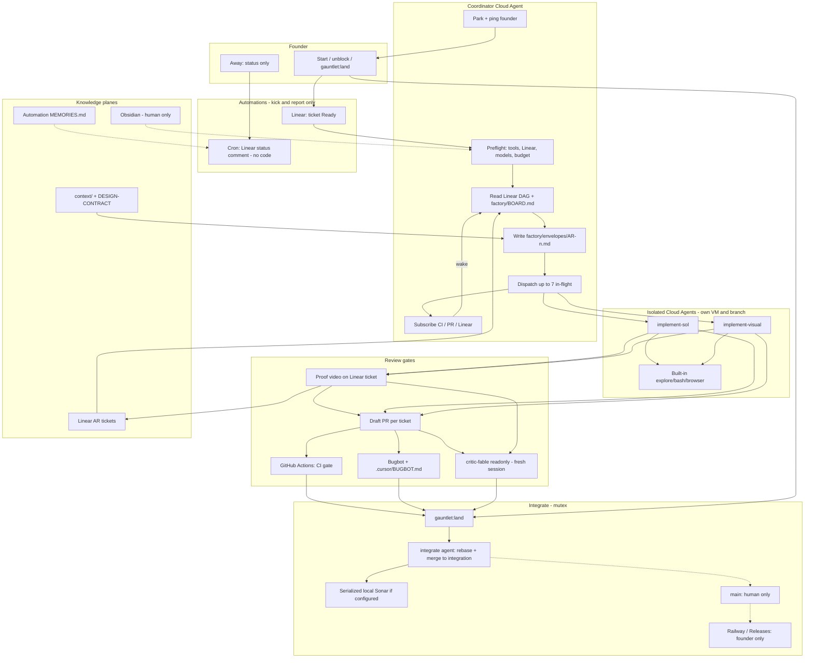
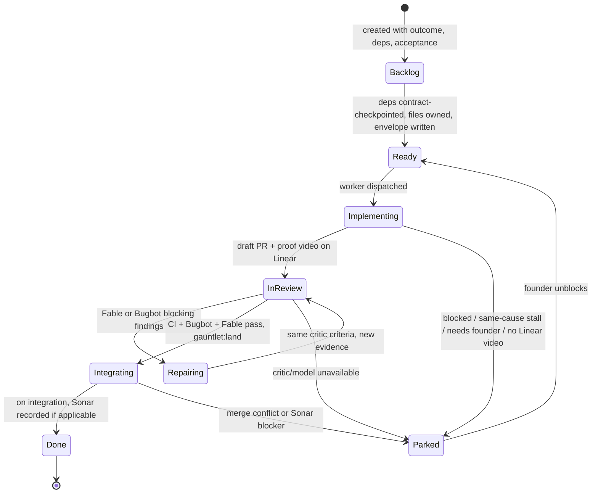
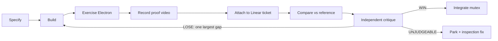
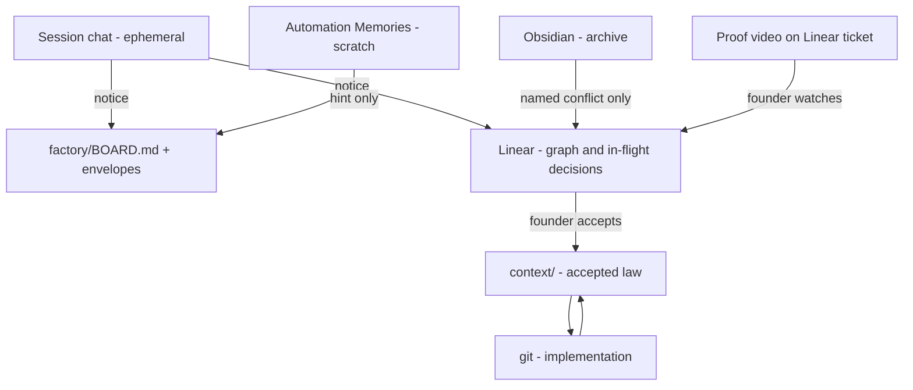

# Cursor software factory

Owning page for running Applied Research’s autonomous SDLC on Cursor. Product behavior stays in [product](product.md). This page owns the factory graph, context/memory rules, and the implementation handoff.

**New Cloud Agent session:** start at [Implementation handoff](#implementation-handoff-new-session). Do not rebuild the product in that session unless the founder explicitly expands scope. The first deliverable is the factory harness in git.

Source of the loop: founder gauntlet prompt (2026-09-08) originally at `~/.superset/projects/capstone/context/design-handoff/GAUNTLET-PROMPT.md`. That file is not in this GitHub tree. Operational rules below are the Cursor mapping of that prompt plus the conservative defaults for still-open founder questions.

## Conservative defaults (override only with a Linear decision)

Until the founder records otherwise:

- Factory is **session-bound**. Automations may **start** a coordinator (Linear Ready) or send **status** (Linear comment). They must not keep implementing after the coordinator run ends. **Slack is out of this factory.**
- User-visible tickets are not InReview until a **proof video is attached to the Linear issue**. That video is how the founder verifies the feature. Do not substitute a screenshot, a unit-test log, or a PR description. Harness-only tickets may skip the video when the envelope says so.
- Land reviewed slices to an **`integration` branch** (create it). Do **not** auto-merge to `main`, deploy, publish, sign, or change billing.
- Merge only with label `gauntlet:land` after CI gate + Bugbot + independent Fable review. No merge-queue agent until that label exists.
- **Playbook** remains deferred. Do not resurrect its rejected design.
- **Seven concurrent workers** including reviewers.
- Models: **gpt-5.6-sol High** implementer; **claude-fable-5-1-thinking-high** independent critic. If gpt-6-astra is unavailable, visual implementation uses Sol High plus a **different-model** visual critic (Fable). Do not let the author accept its own work.
- Live OpenRouter tests: **US$2 cumulative and 10 requests** (AR-7). Not a fresh allowance.
- Cursor Automation Memories are **scratch only**. Product law lives in `context/` and Linear.
- Local Sonar stays coordinator-owned and serialized; it is **not** a GitHub PR required check until hosting is decided.
- Do not paste secrets into chat, Linear, renderer variables, or reviewer envelopes.

---

## Full factory graph

### System graph



### Ticket state graph



### Inner loop (one ticket)



Cap inner rounds at **3** then Park. Each critique is a **new** Fable session: spec + artifacts + Linear proof video only, never the implementer transcript. Missing Linear video is **UNJUDGEABLE**, not a WIN.

### Knowledge / memory graph



Promotion rule: chat/memory may notice; Linear records; `context/` governs; code implements; Obsidian explains history. Agents write **down** that ladder, never **up** from Memories into product law.

---

## Roles and Cursor primitives

| Role                 | Primitive                         | Model                             | Sees                                                 | Must not see                                |
| -------------------- | --------------------------------- | --------------------------------- | ---------------------------------------------------- | ------------------------------------------- |
| Coordinator          | One Cloud Agent                   | Strong reasoning                  | BOARD, Linear frontier, envelopes, PR URLs, spend    | Full diffs, screenshots, Effect tree, vault |
| implement-sol        | Cloud subagent, own branch        | `gpt-5.6-sol` High                | One envelope + owning context pages + ownership glob | Other tickets, critic history, secrets      |
| implement-visual     | Cloud subagent                    | Astra if available, else Sol High | Visual/motion/Manim/Three.js envelopes               | Independent acceptance of its own PR        |
| critic-fable         | Fresh readonly subagent           | `claude-fable-5-1-thinking-high`  | Spec, criteria, Linear proof video, artifacts        | Builder rationale, Memories                 |
| integrate            | Small Cloud Agent                 | Fast/cheap OK                     | Frozen SHA, CI, Bugbot, Fable verdict                | Redesign                                    |
| Explore/Bash/Browser | Built-in subagents                | Fast                              | Noisy search/logs/DOM                                | Decisions                                   |
| Status               | Scheduled Automation, **no repo** | Any                               | BOARD + open PRs                                     | Code edits                                  |
| Bugbot               | Managed PR review                 | Bugbot                            | Diff + `.cursor/BUGBOT.md`                           | Product vault, secrets                      |

Concurrency: count coordinator? **No.** Count implementers + critics + integrate that are in-flight. Max **7**. Status Automation does not count.

---

## Context packing

Do **not** always-apply the full gauntlet prompt.

| Layer        | Location                                      | When loaded                                 |
| ------------ | --------------------------------------------- | ------------------------------------------- |
| Index        | Root `AGENTS.md`                              | Always; keep short                          |
| Path law     | `.cursor/rules/*.mdc`                         | Matching globs                              |
| Playbooks    | `.cursor/skills/gauntlet-*/`                  | Coordinator `@`s or agent-decides           |
| Node payload | `factory/envelopes/AR-*.md` + Linear          | Worker prompt                               |
| Evidence     | Linear proof video + `factory/evidence/AR-*/` | Founder verify + critic                     |
| Graph        | Linear + `factory/BOARD.md`                   | Coordinator                                 |
| Archive      | Obsidian                                      | Human; coordinator only on a named conflict |

Envelope (worker’s entire extra prompt):

```text
Ticket: AR-n
Outcome:
Ownership glob:
Forbidden paths:
Contract: factory/contracts/<name>.md @ <sha>
Deps satisfied:
Acceptance criteria:
States: empty / loading / error / offline / canceled / retry
Evidence dir: factory/evidence/AR-n/
Proof video: required | harness-only skip
Linear issue:
Do not self-accept. Open a draft PR. Stop.
```

Reviewed **contract checkpoints** can release consumer tickets before the producer is Done. Integration still requires the accepted producer implementation.

### Proof video (founder verify)

For every ticket whose acceptance is user-visible in the app, InReview is illegal until a **proof video is attached to the Linear issue**.

1. Worker runs the app (Electron) and records a screen capture of the acceptance path (computer-use + RecordScreen). Cover required states when the envelope lists them.
2. Save locally under `factory/evidence/AR-n/proof.mp4` (or `.webm`). **Do not commit the binary to git** (gitignored). Linear is the durable copy.
3. Attach that file to the Linear issue. Comment the frozen SHA and what the video shows.
4. Cite the Linear issue in the draft PR. Founder verifies by watching the Linear attachment, not by reading the PR.

Harness-only / docs-only envelopes may set `Proof video: harness-only skip`. Missing Linear MCP: Park; draft `factory/receipts/` with the local path; do not pretend the founder can verify.

Coupling: parallelize uncoupled slices only. Serialize record/source-version/link schema, design tokens, preload bridges, integration merge, desktop/Playwright, and Sonar.

---

## Implementation handoff (new session)

The **Cursor factory harness** for `aaryandas/applied-research` is in git: skills, subagents, rules, `.cursor/BUGBOT.md`, and `factory/` envelopes. Do **not** rebuild it, and do not implement product UI/backend (Reader, Canvas, Railway, OpenRouter app-managed AI, Clicky, Manim) unless the founder expands scope.

**Coordinator session:** confirm the tree below exists, BOARD is readable, list Ready vs blocked founder actions (Linear MCP, Bugbot, `integration` branch, secrets). If Linear MCP is missing, draft receipts under `factory/receipts/` and stop after the dry-run report.

**Harness edit:** change protocol in this page first, then keep the files below true. If you expand into product implementation, you have left scope.

### Read first

- This file.
- [AGENTS.md](../AGENTS.md), [conventions](conventions.md), [development](development.md), [releases](releases.md).
- [knowledge-base.md](knowledge-base.md) only to know the vault is **out of band**.
- Do not load `context/repos/effect/` as application code.

### Out of scope

- Building product surfaces or Effect runtime adoption.
- Creating Automations via undocumented APIs (write `cursor.com/automations` recipes; founder clicks Save).
- Deploy, signing, SonarQube Cloud purchase, importing the SuperSet worktree.
- Weakening CI, CSP, or coverage to look green.
- Committing secrets, real vault data, or OpenRouter keys.

### Deliverable tree

```text
AGENTS.md                                 # add factory row + short Cursor Cloud section
context/factory.md                        # this page (already exists; keep it true)
.cursor/rules/electron.mdc                # always-ish isolation for main/preload
.cursor/rules/renderer-design.mdc         # globs src/renderer/**
.cursor/rules/gauntlet-loop.mdc           # apply intelligently for factory work
.cursor/BUGBOT.md                         # provenance, no mock success, no renderer secrets
.cursor/agents/implement-sol.md
.cursor/agents/implement-visual.md
.cursor/agents/critic-fable.md            # readonly: true; Fable 5.1 High
.cursor/agents/integrate.md
.cursor/skills/gauntlet-coordinator/SKILL.md
.cursor/skills/gauntlet-implement/SKILL.md
.cursor/skills/gauntlet-critic/SKILL.md
.cursor/skills/gauntlet-integrate/SKILL.md
factory/README.md                         # index of BOARD, envelopes, contracts, evidence
factory/BOARD.md                          # generated-style table; start empty/template
factory/envelopes/.gitkeep
factory/contracts/.gitkeep
factory/evidence/.gitkeep
factory/automation-recipes.md             # copy-paste for cursor.com/automations
factory/receipts/                        # drafted Linear notes when MCP is missing
```

Keep skill `SKILL.md` files short; put long protocol in `references/` under each skill so context stays progressive.

### Subagent frontmatter (required)

- `implement-sol`: `model` gpt-5.6-sol High (use the repo’s supported id form, e.g. `gpt-5.6-sol[effort=high]` if that is what Cursor honors).
- `critic-fable`: `readonly: true`, Fable 5.1 High, description must say **independent acceptance**; never the author.
- `implement-visual`: visual/motion/Manim/Three.js; cannot supply the acceptance verdict for its own PR.
- `integrate`: merge to `integration` only when `gauntlet:land` + CI gate + Bugbot success + Fable WIN + Linear proof video (unless harness-only skip).

If a configured model is unavailable, record the actual id that ran in BOARD and Park visual-Astra tickets rather than silently swapping into self-review.

### Coordinator skill must enforce

1. Preflight: Node 24 / `npm ci` documented; Linear MCP (read **and** attach files); GitHub; computer-use for proof video; remaining live-test budget; Fable launch probe (one bounded call). Surface failures in the conversation **and** a drafted Linear note; continue independent harness work. Never mark InReview without the Linear proof video when the envelope requires it.
2. Never dispatch without an envelope.
3. Never let a worker mark Done.
4. Subscriptions instead of polling.
5. Stop-hook / `/loop` must not implement the factory. `/loop` is status-only if used at all.
6. `preCompact` reminder: persist BOARD + Linear before the window is summarized (hook may only observe; the skill must write early).

### Automation recipes to document (founder enables)

1. **Start coordinator** — Linear issue status → Ready. Repo: this repo. No Slack. Prompt: “You are the factory coordinator. Read `context/factory.md`. Do not implement product features. Dispatch per BOARD.”
2. **Status** — cron 4 hours, **no repository**. Prompt: summarize open factory PRs and Parked tickets on Linear; do not edit code. Memories allowed for last-report pointer only.
3. **Fable critic** — draft PR opened / PR pushed, only if coordinator did not already attach a critic. Prompt: load `gauntlet-critic` skill; readonly.
4. **Do not** add a cron that keeps building. **Do not** add deploy-on-green.

### GitHub (document; founder/admin clicks)

- Require **CI gate** on PRs into `integration` and `main`.
- Enable Bugbot on this repo; prefer fail-on-unresolved if the plan supports it.
- Create `integration` from current development branch. Protect it. No auto-deploy.

### Verification for this harness change

- `npm run check` still passes (docs/config only should not break it).
- Skills/subagents are valid markdown with required frontmatter.
- `AGENTS.md` factory row exists; this page stays the owner.
- Dry-run: in the PR description, paste a coordinator kickoff prompt a human can give a Cloud Agent.

### Kickoff prompt to leave in the PR

```text
You are the Applied Research factory coordinator on Cursor.
Read context/factory.md and AGENTS.md.
Do not implement product features in this run.
Confirm the harness files exist, BOARD is readable, and list Ready vs blocked
founder actions (Linear MCP, Bugbot, integration branch, secrets).
If Linear is missing, draft receipts under factory/ and say so.
Stop after the dry-run report unless the founder expands scope.
```

That prompt is the post-harness coordinator dry-run. The harness-implementation prompt (build the tree, then report) is historical; do not run it again unless files are missing.

### Founder actions this session cannot do

- Authenticate Linear MCP so agents can attach proof videos to tickets.
- Enable Bugbot and branch rules.
- Add Cloud Secrets (Linear, OpenRouter for later product work, Sonar).
- Paste design-handoff from the SuperSet worktree into git.
- Confirm Astra availability and auto-land vs `gauntlet:land` (defaults above).

Record those as a short “external setup” list in the PR, not as fake completions.

---

## Relationship to the product gauntlet

When the founder later starts a **product** gauntlet, the coordinator reads this page **and** the product context. That later run may implement Reader/Canvas/backend per `GAUNTLET-PROMPT.md`. It still must use envelopes, Fable isolation, the 7-worker cap, and must not treat Memories or Obsidian as law.

This checkout still describes storage/providers/hosting as open in [product.md](product.md) while the 2026-09-08 gauntlet prompt treats Railway, Better Auth + GitHub, OpenRouter, and Effect v3.22.1 as selected. Do **not** silently rewrite product.md in the harness session. Open or reuse a Linear decision ticket and wait; the [decision audit](decision-audit.md) exists so agents surface discrepancies instead of inventing a new stack.
