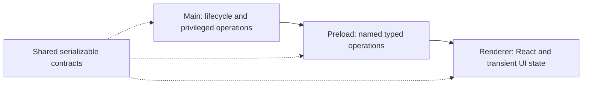

# Development foundation

The implemented foundation is a single Electron application package with React, TypeScript, electron-vite, and handwritten CSS. Node 24 LTS runs development tools. Electron carries its own runtime; the lockfile pins the actual versions. Vite 7 is intentional because electron-vite 5 declares compatibility through Vite 7.

This scaffold implements lifecycle, renderer isolation, a minimal preload bridge, and a clearly labeled development screen. It does not implement a sample database, fake AI, or a speculative domain schema.

## Process responsibilities

- **Main** owns application startup, windows, permissions, navigation policy, and future filesystem/network work. Keep operation implementations in modules with small interfaces as they are built.
- **Preload** currently exposes only runtime metadata via `window.desktop.info`. It bundles to CommonJS for Electron's sandbox. No raw IPC or Node primitives cross this seam.
- **Renderer** owns presentation. ESLint rejects imports from Electron, Node, main, and preload. Transient selection/focus/viewport state belongs here; durable drafts will need main-process storage.
- **Contracts** contains types that cross the process seam. Add runtime validation when external inputs or commands are introduced; TypeScript alone does not validate messages.

Context isolation, renderer sandboxing, disabled Node integration, denied new windows, restricted document navigation, and denied permissions are explicit defaults. Production CSP disallows renderer networking and inline scripts. Development permits Vite refresh and its localhost WebSocket. Future provider calls belong in main, not in renderer exceptions to this policy.

## Extending the foundation

Create modules when their behavior is implemented. Likely responsibilities include Learning Path, sources, activities/results, vault persistence, cited explanations, and Playbook export. These are design candidates, not empty directories to generate now.

Use source-format and model-provider adapters when actual implementations vary. Keep one concrete persistence implementation until another is needed. Avoid per-table generic repositories, global event buses, and dependency injection containers without a demonstrated need. Plain modules and functions are sufficient for the current scaffold.

Before domain implementation, design stable source/artifact identities, human-author constraints, path revisions, crash recovery, and the activity → result → reflection loop. Keep source sentence references distinct from evidence imported from experiments. See [product decisions](../product/decision-record.md).

## Verification surfaces

- Unit tests cover navigation policy and the renderer's foundation state.
- Coverage applies to testable implementation; lifecycle/entry wiring is explicitly excluded and exercised through real Electron smoke tests instead.
- Electron smoke tests verify startup, the loaded preload metadata, renderer isolation, and popup denial.
- The same smoke test runs against the unpacked application, catching missing preload/renderer files and packaging mistakes.
- CI runs on Linux, Windows, and macOS. This is a scaffold verification floor; product behavior and evaluations must be added as the product exists.
